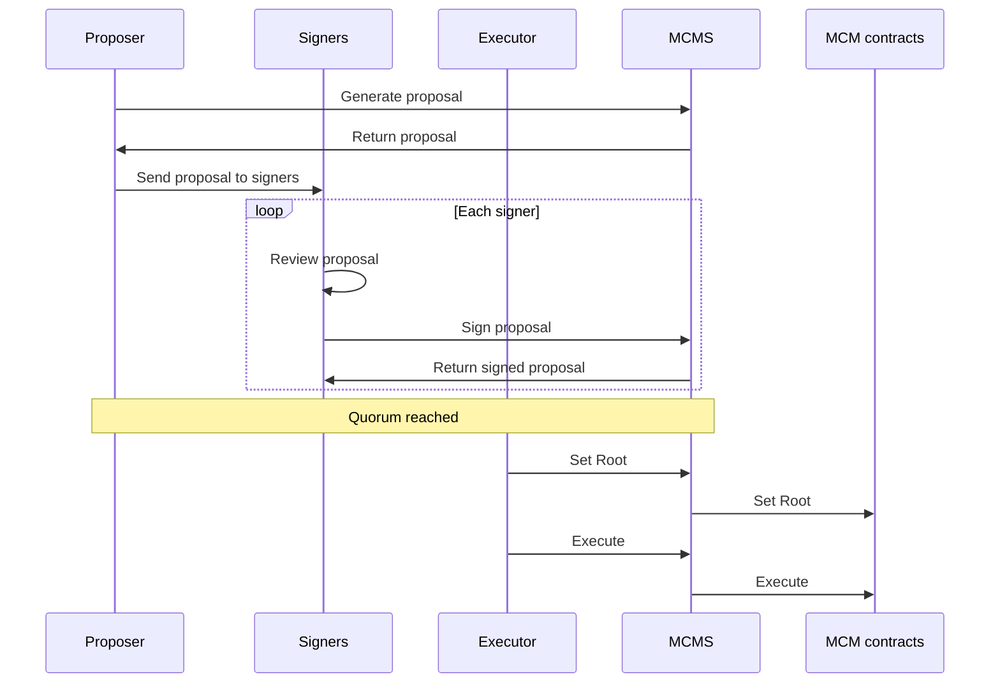
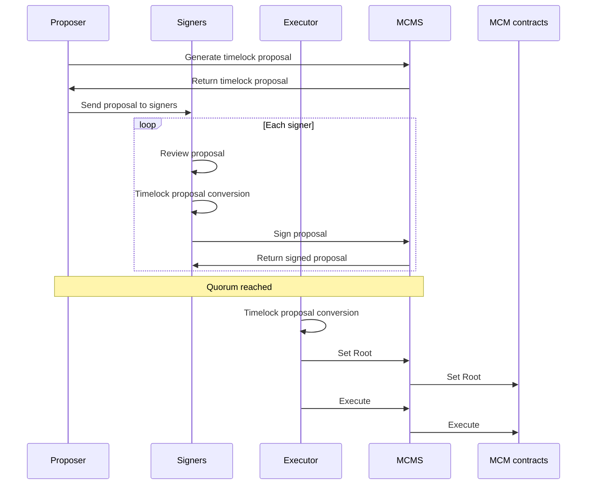

# Key Concepts

MCMS provides a standardized interface that facilitates scalable multisig operations across multiple blockchains. Proposers, Executors and Signers will utilize MCMS to interact with the MCM contracts to manage multisig operations across different products and blockchains.

This library offers support for 2 types of proposals:

1. **MCMS Proposal:** This proposal is used to manage multisig operations across different products and blockchains.
2. **TimeLock Proposal:** This proposal is used to manage time-locked multisig operations across different products and blockchains. This proposal type additionally supports batching of operations.

## MCMS Proposal

An MCMS proposal interacts directly with the MCM contract.

### How it works

The following steps need to be performed for a set of onchain maintenance operations:

1. **Proposal generation:** A proposer generates a proposal using MCMS containing the desired operations. This proposal can be represented as a Merkle tree containing all the necessary operations..
2. **Signing:** A quorum of signers must sign the Merkle root offchain. These signatures are then stored within the proposal.
3. **Set Root:** Once the quorum is reached, the signed Merkle root is sent to MCM contracts across all chains via the `SetRoot` call on the contract. Anyone with the root and signatures offchain can send it to the MCM contracts.
4. **Execute:** A multi-sig operation is executed by providing a Merkle proof for the specific operation. Anyone with the complete Merkle tree offchain can execute the action. Each operation must be executed in sequence.

## Timelock Proposal

A timelock proposal interacts with both the MCM contract and the RBACTimelock contract. Unlike immediate execution, the operations in a timelock proposal are delayed and can only be executed after a specified time period. The timelock proposal's operations are encapsulated within a standard proposal operation but target the timelock contract instead of the actual contract. Once the timelock period has expired, the operations can be executed on the MCM contract, which will then call the RBACTimelock contract to carry out the operations.

### How it works

1. **Proposal generation:** A proposer generates a timelock proposal using MCMS containing the desired operations. Each operation is wrapped in a `scheduleBatch` call to the RBACTimelock contract and can be represented as a Merkle tree.
2. **Signing:** A quorum of signers must sign the Merkle root. This is handled offchain and the signatures are stored on the proposal itself.
3. **Set Root:** Once quorum is reached, the signed Merkle root is sent to ManyChainMultiSig contracts across all chains through the `SetRoot` call on the MCM contract. Anyone who has been given the root and the signatures offchain can send it to MCM contracts.
4. **Execute:** A multi-sig operation is executed by providing a Merkle proof for that specific operation. This will call the MCMS contract, which in turn will call the RBACTimelock contract to execute the scheduled operation. Anyone who has been given the full Merkle tree offchain can execute the action. Each operation must be executed in sequence.

<!-- The following steps need to be performed for a set of onchain maintenance operations
on the OWNED contracts:

1. [offchain, done by the Go Lib] **Merkle tree generation & signing (Required for all proposals):** A Merkle tree
   containing all the required
   ManyChainMultiSig ops (containing RBACTimelock.scheduleBatch calls) for the desired
   maintenance operations is generated by the proposers.
   A quorum of signers from the proposer ManyChainMultiSig must sign (offchain) the Merkle root.
2. **`setRoot` (Required for all proposals) call on all relevant ManyChainMultiSig contracts across chains:** The signed
   Merkle root is then sent to ManyChainMultiSigs. Anyone who has been given the root
   and the signatures offchain can send it to ManyChainMultiSigs.
3. **`execute` on ManyChainMultiSig (Required for all proposals):** To propose an action to the RBACTimelock, a
   multi-sig op is executed by providing a Merkle proof for that specific op. Anyone who has been given the full Merkle
   tree offchain can propose the action.
4. **`executeBatch` on RBACTimeLock (Optional - Only for TimeLock Proposals):** After the timelock wait period expires,
   the proposed actions in TimeLock can be executed. This assumes that the cancellers have not cancelled them in the
   meantime. Anyone can execute the actions because all the required information is available on the blockchain through
   event logs. -->