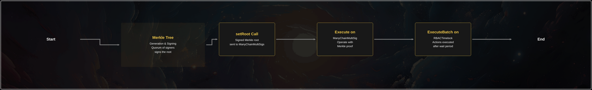

# Proposal's Flow

## Propose-and-Execute Flow

The following steps need to be performed for a set of onchain maintenance operations
on the OWNED contracts:

1. [offchain, done by the Go Lib] **Merkle tree generation & signing (Required for all proposals):** A Merkle tree
   containing all the required
   ManyChainMultiSig ops (containing RBACTimelock.scheduleBatch calls) for the desired
   maintenance operations is generated by the proposers.
   A quorum of signers from the proposer ManyChainMultiSig must sign (offchain) the Merkle root.
2. **`setRoot` (Required for all proposals) call on all relevant ManyChainMultiSig contracts across chains:** The signed
   Merkle root is then sent to ManyChainMultiSigs. Anyone who has been given the root
   and the signatures offchain can send it to ManyChainMultiSigs.
3. **`execute` on ManyChainMultiSig (Required for all proposals):** To propose an action to the RBACTimelock, a
   multi-sig op is executed by providing a Merkle proof for that specific op. Anyone who has been given the full Merkle
   tree offchain can propose the action.
4. **`executeBatch` on RBACTimeLock (Optional - Only for TimeLock Proposals):** After the timelock wait period expires,
   the proposed actions in TimeLock can be executed. This assumes that the cancellers have not cancelled them in the
   meantime. Anyone can execute the actions because all the required information is available on the blockchain through
   event logs.